# 🚀 Google BigQuery Machine Learning with Looker

## 📋 Descripción del Proyecto

Este proyecto utiliza Google BigQuery ML para analizar datos de sesiones de Google Analytics. El objetivo principal es entrenar un modelo de machine learning utilizando la interfaz de BigQuery para predecir la probabilidad de conversión de los usuarios en un sitio web, y posteriormente desplegar los resultados en Looker Studio para su visualización.

El dataset utilizado contiene datos de sesiones de Google Analytics exportados a BigQuery, incluyendo información sobre visitantes, dispositivos, fuentes de tráfico, comportamiento de navegación y conversiones. La estructura de datos incluye campos como visitorId, visitId, totals (pageviews, timeOnSite, transactions), trafficSource, device, geoNetwork y hits.

## 1. 🔍 Preprocesamiento de datos

En la fase de preprocesamiento, se realizaron las siguientes tareas:

- 📊 Exploración inicial de las particiones diarias de datos para comprender la estructura
- 🔎 Consulta de datos a través de múltiples particiones utilizando wildcards (_TABLE_SUFFIX)
- 🔄 Transformación de estructuras de datos anidadas en columnas planas mediante el uso de UNNEST
- 🧹 Limpieza y preparación de datos para el análisis, asegurando la calidad de los mismos
- 🔧 Conversión de campos complejos como hits, totals y trafficSource en formatos más manejables

## 2. 📈 Análisis de datos

Durante la fase de análisis, se llevaron a cabo diversas consultas para comprender los patrones de comportamiento de los usuarios:

- 🛒 Análisis del número total de transacciones por navegador y tipo de dispositivo
  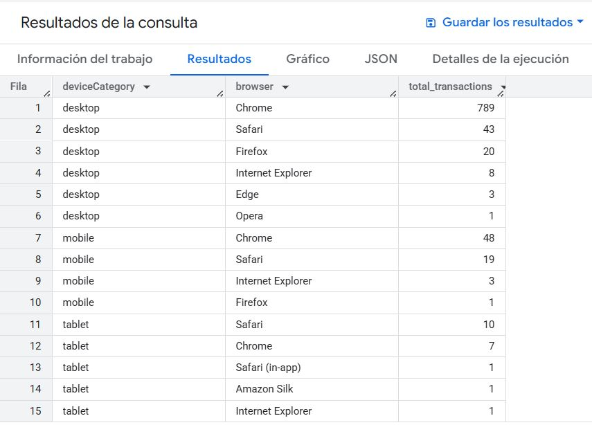

- ↩️ Cálculo de tasas de rebote por origen de tráfico
  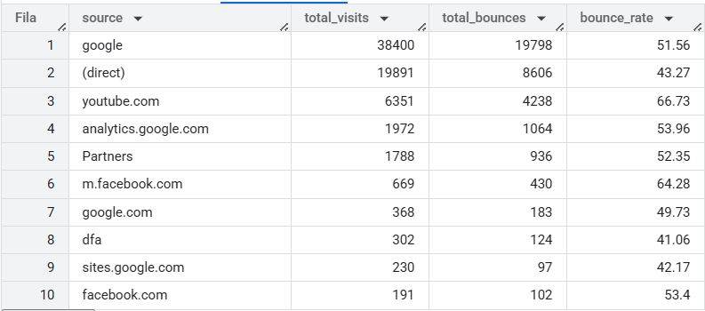

- 💰 Determinación de tasas de conversión por sistema operativo, categoría de dispositivo y navegador
  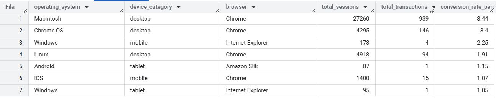

- 🛍️ Análisis del porcentaje de visitantes que realizaron compras
  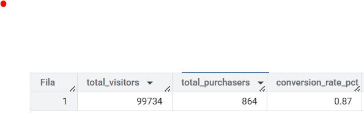

- 💵 Evaluación de ingresos por fuente de tráfico y medio
  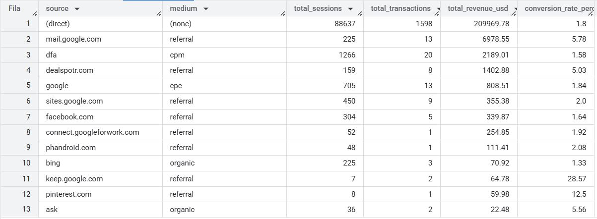

- 🌎 Identificación de países con mayor tasa de rebote
  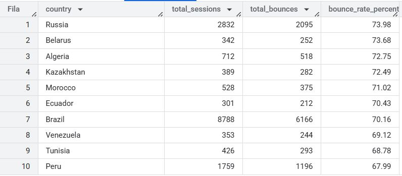

- ⏱️ Análisis de tiempo promedio en el sitio por tipo de dispositivo
  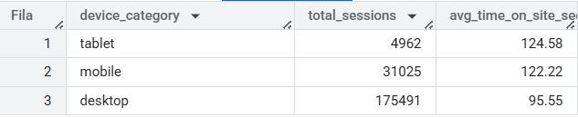

- 📣 Comparación del rendimiento de diferentes campañas de marketing
  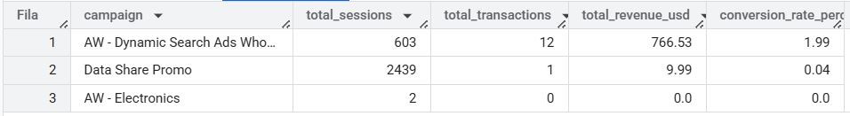

- 👁️ Análisis de páginas vistas por navegador
  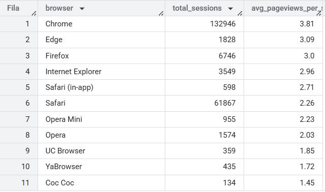

- 📅 Estudio de patrones de sesiones por día de la semana
  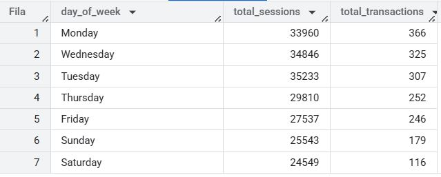

## 3. 🤖 Creación del Modelo Predictivo

Se crearon cuatro modelos diferentes utilizando BigQuery Machine Learning para predecir la probabilidad de que un usuario realice una transacción:

1. **Modelo 1** 📊: Regresión logística básica con un conjunto limitado de características
2. **Modelo 2** 📈: Regresión logística avanzada con características adicionales y configuración de hiperparámetros
3. **Modelo 3** 🌲: Random Forest Classifier con conjunto extenso de características y métricas derivadas
4. **Modelo 4** 🌳: Random Forest Classifier optimizado con características temporales, de comportamiento y geográficas

Cada modelo fue evaluado mediante métricas como la matriz de confusión, precisión, recall, F1-score y AUC. Tras un análisis exhaustivo, se seleccionó el **Modelo 3** como el de mejor desempeño basado en las métricas proporcionadas por BigQuery Machine Learning.

### ✨ Resultados del Modelo Seleccionado (Modelo 3)

El Modelo 3, un Random Forest Classifier, mostró resultados superiores en términos de precisión y capacidad predictiva. A continuación se presentan las métricas de evaluación:

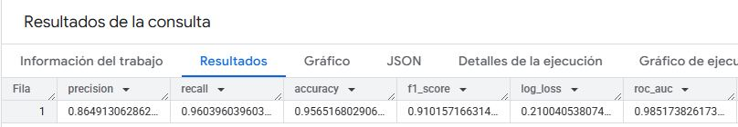

La matriz de confusión del modelo seleccionado demuestra un equilibrio óptimo entre falsos positivos y falsos negativos:

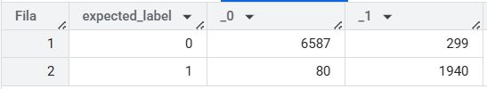

Este modelo incorpora características complejas que capturan mejor los patrones de comportamiento de los usuarios, incluyendo métricas de tráfico, patrones de conversión históricos y datos temporales, lo que permitió un rendimiento predictivo más robusto comparado con los otros modelos evaluados.

## 4. 📊 Dashboard en Looker Studio

Para la visualización de los resultados:

- 📁 Se creó una tabla en BigQuery para almacenar las predicciones generadas por el modelo de mejor desempeño
- 📋 La tabla incluye los datos originales junto con las etiquetas predichas y la probabilidad de conversión
- 📅 Los datos se particionaron por fecha para optimizar el rendimiento de las consultas
- 📈 Se desarrolló un dashboard interactivo en Looker Studio para visualizar los patrones y predicciones

El dashboard está disponible en línea en: [https://lookerstudio.google.com/u/0/reporting/92ef0785-cd03-4e19-aa0f-7a8885c62b52/page/tEnnC](https://lookerstudio.google.com/u/0/reporting/92ef0785-cd03-4e19-aa0f-7a8885c62b52/page/tEnnC)

## 📂 Estructura del Repositorio

El proyecto está organizado de la siguiente manera:

```
📁 src/
   └── 📁 images/         # Imágenes de análisis y métricas
📄 README.md              # Documentación del proyecto
📁 scripts/               # Consultas SQL y scripts de BigQuery 
```

- **src/images/**: Contiene todas las capturas de pantalla y visualizaciones utilizadas en este README
- **README.md**: Este archivo que proporciona una visión general del proyecto
- **scripts/**: Incluye los archivos SQL utilizados para el preprocesamiento, análisis de datos y creación de modelos

## Tecnologías utilizadas:

- 🔍 Google BigQuery: Para almacenamiento, consulta y análisis de datos
- 🧠 BigQuery ML: Para el entrenamiento y evaluación de modelos de machine learning
- 📝 SQL: Para la manipulación y transformación de datos
- 📊 Looker Studio: Para la visualización interactiva de los resultados

## 🎯 Conclusiones

Este proyecto demuestra la efectividad de BigQuery ML para predecir comportamientos de usuarios basados en datos de Google Analytics. Los modelos creados permiten identificar visitantes con alta probabilidad de conversión, lo que puede ayudar a optimizar estrategias de marketing y mejorar la experiencia del usuario.

La combinación de BigQuery ML con Looker Studio ofrece una solución completa para el análisis predictivo y la visualización de datos, permitiendo extraer insights valiosos de grandes volúmenes de datos de manera eficiente.
